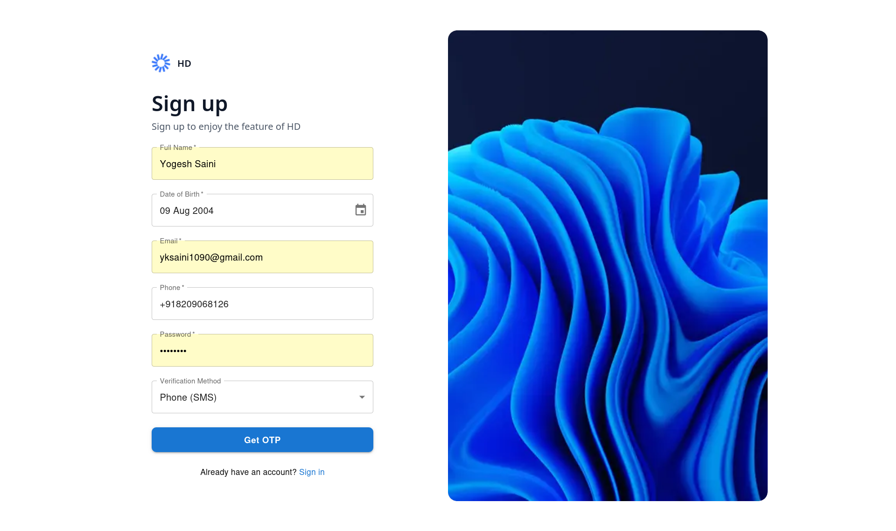
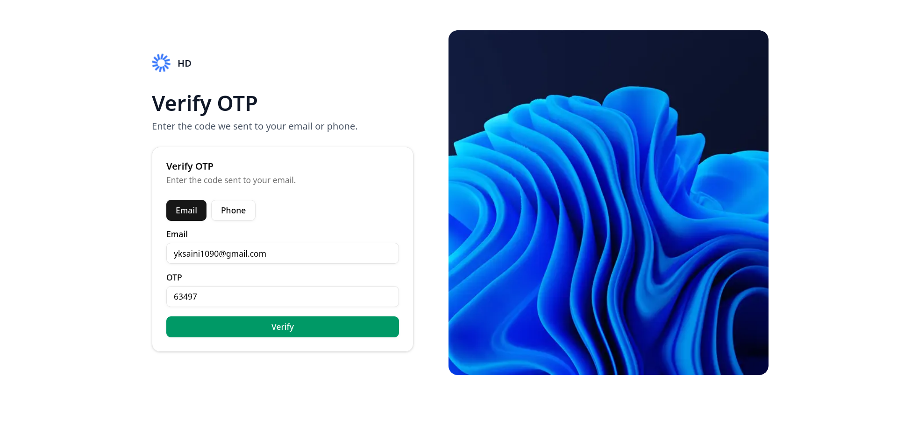
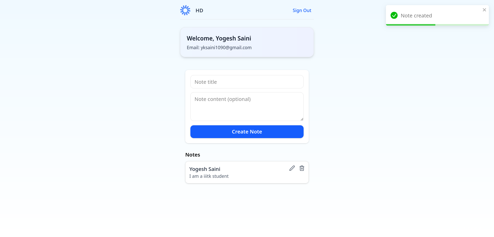
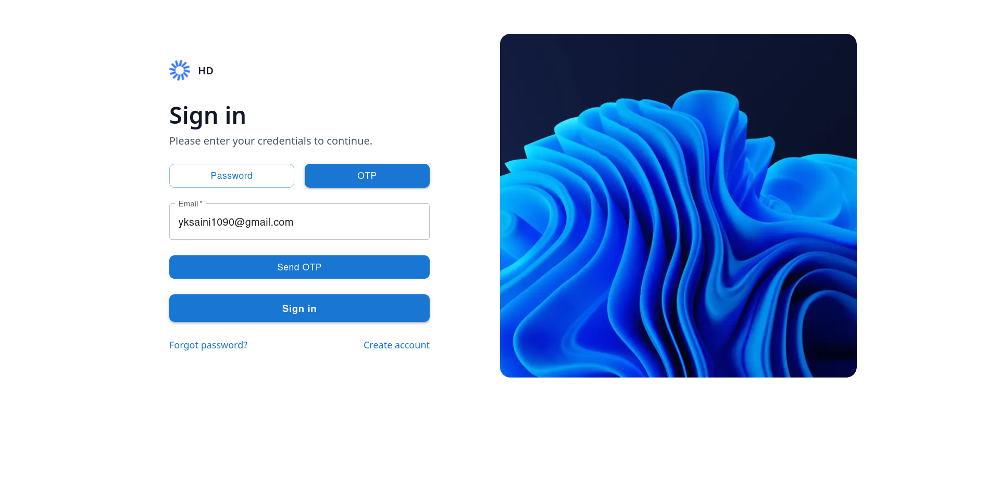
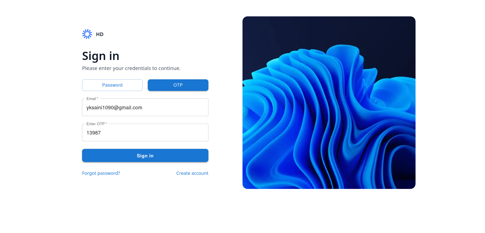
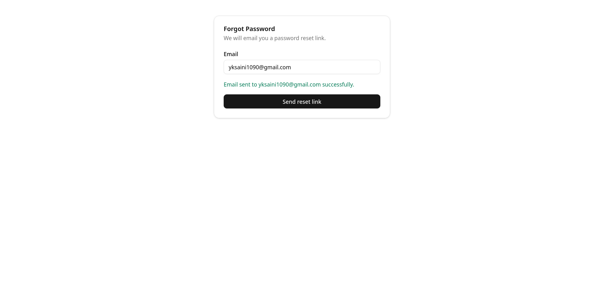
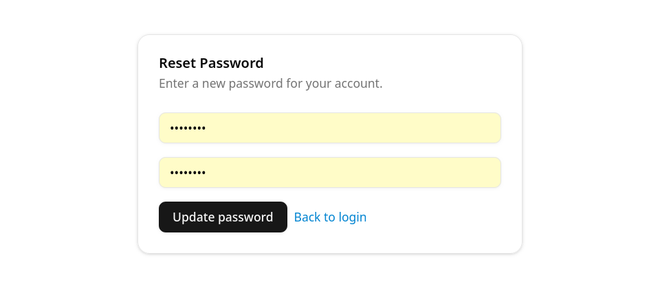

# HD Notes App

A full-stack notes management application with advanced authentication features, built with modern web technologies. This application provides a secure, user-friendly platform for creating, managing, and organizing personal notes with multiple authentication options.

## 🌟 Project Overview

HD Notes App is a comprehensive solution that combines a robust Node.js backend with a sleek React frontend, offering users flexibility in authentication methods and seamless note management capabilities.

### Key Highlights
- **Dual Authentication**: Choose between password or OTP-based login
- **Multi-Channel Verification**: Email and SMS OTP support
- **Secure Architecture**: JWT tokens, bcrypt encryption, and comprehensive validation
- **Modern UI/UX**: Responsive design with Material-UI and Tailwind CSS
- **Real-time Features**: Live updates and optimistic UI interactions
- **Automated Management**: Self-cleaning unverified accounts

## 🏗️ Architecture

```
┌─────────────────┐    ┌─────────────────┐    ┌─────────────────┐
│   Frontend      │    │    Backend      │    │   External      │
│   (Next.js)     │◄──►│   (Express)     │◄──►│   Services      │
│                 │    │                 │    │                 │
│ • React 18      │    │ • TypeScript    │    │ • MongoDB       │
│ • TypeScript    │    │ • Express.js    │    │ • Twilio SMS    │
│ • Tailwind CSS  │    │ • Mongoose      │    │ • Email SMTP    │
│ • Material-UI   │    │ • JWT Auth      │    │ • NeonDB        │
│ • SWR Caching   │    │ • Bcrypt        │    │                 │
└─────────────────┘    └─────────────────┘    └─────────────────┘
```

## 🚀 Quick Start

### Prerequisites
- Node.js (v18+)
- MongoDB database
- Twilio account (for SMS)
- Email service (Gmail/SMTP)

### 1. Clone Repository
```bash
git clone <repository-url>
cd hd-notes-app
```

### 2. Backend Setup
```bash
cd functions
npm install
```

Create `functions/.env`:
```env
# Server
PORT=3000
NODE_ENV=development

# Database
MONGO_URI=your_mongodb_connection_string

# JWT
JWT_SECRET_KEY=your_super_secret_jwt_key
JWT_EXPIRES_IN=7d
COOKIE_EXPIRE=7

# Email (Nodemailer)
SMTP_HOST=smtp.gmail.com
SMTP_PORT=587
SMTP_MAIL=your_email@gmail.com
SMTP_PASSWORD=your_app_password

# Twilio SMS
TWILIO_ACCOUNT_SID=your_twilio_account_sid
TWILIO_AUTH_TOKEN=your_twilio_auth_token
TWILIO_PHONE_NUMBER=your_twilio_phone_number

# Frontend
FRONTEND_URL=http://localhost:3001
```

Start backend:
```bash
npm run dev
```

### 3. Frontend Setup
```bash
cd ../ui
npm install
```

Create `ui/.env.local`:
```env
NEXT_PUBLIC_API_URL=http://localhost:3000
```

Start frontend:
```bash
npm run dev
```

### 4. Access Application
- Frontend: `http://localhost:3001`
- Backend API: `http://localhost:3000`

## 🔄 Complete User Journey

### 1. Registration Process
```
User Registration → Email/Phone Verification → Account Activation → Dashboard Access
```

1. **Sign Up**: User fills registration form with personal details
2. **Verification Method**: Choose email or SMS for OTP delivery
3. **OTP Verification**: Enter received code to verify account
4. **Account Activation**: Successful verification activates account
5. **Automatic Login**: User is logged in and redirected to notes

### 2. Login Options
```
Login Page → Method Selection → Authentication → Dashboard
```

**Password Method**:
- Enter email and password
- Instant authentication
- JWT token issued

**OTP Method**:
- Enter email address
- Request OTP via API
- Receive OTP via email/SMS
- Enter OTP for authentication

### 3. Notes Management
```
Dashboard → Create/View Notes → Edit/Delete → Real-time Updates
```

1. **View Notes**: See all personal notes in a clean list
2. **Create Notes**: Add new notes with title and content
3. **Edit Notes**: Inline editing with save/cancel options
4. **Delete Notes**: Remove notes with confirmation
5. **Real-time Sync**: Changes reflect immediately

## 📊 Features Deep Dive

### Authentication System

#### Multi-Factor Security
- **Age Verification**: Minimum 13 years old requirement
- **Email Validation**: Proper email format checking
- **Password Strength**: Minimum 8 characters with hashing
- **Rate Limiting**: Protection against registration spam (max 3 attempts)
- **Account Verification**: Mandatory verification before access

#### OTP Integration
- **Email OTP**: HTML formatted emails with 5-digit codes
- **SMS OTP**: Twilio integration with formatted delivery
- **Expiration**: 10-minute OTP validity period
- **Code Generation**: Cryptographically secure random codes

#### Session Management
- **JWT Tokens**: Secure, stateless authentication
- **HTTP-Only Cookies**: XSS protection
- **Configurable Expiration**: Default 7-day token validity
- **Automatic Refresh**: Session persistence across browser sessions

### Notes Management System

#### CRUD Operations
- **Create**: Title required, content optional
- **Read**: User-specific note retrieval
- **Update**: Partial updates supported
- **Delete**: Soft delete with confirmation

#### Security & Authorization
- **User Isolation**: Notes are strictly user-specific
- **Authorization Middleware**: JWT verification for all note operations
- **Input Validation**: Server-side validation for all inputs
- **Error Handling**: Comprehensive error responses

### Automated Maintenance

#### Account Cleanup System
```typescript
// Runs every 30 minutes
cron.schedule("*/30 * * * *", async () => {
  // Remove unverified accounts older than 30 minutes
  await User.deleteMany({
    accountVerified: false,
    createdAt: { $lt: thirtyMinutesAgo },
  });
});
```

## 🛡️ Security Implementation

### Backend Security
- **Helmet.js**: Security headers
- **CORS Configuration**: Controlled cross-origin access
- **Input Sanitization**: XSS protection
- **Password Hashing**: Bcrypt with salt rounds
- **JWT Security**: Signed tokens with secret keys
- **Rate Limiting**: Registration attempt limitations
- **Token Validation**: Middleware-based authentication checks

### Frontend Security
- **HTTP-Only Cookies**: Secure token storage
- **CSRF Protection**: Cross-site request forgery prevention
- **Input Validation**: Client-side validation before API calls
- **Error Sanitization**: Safe error message display
- **Secure API Communication**: Credentials included in requests

## 🗄️ Database Schema

### User Collection
```javascript
{
  _id: ObjectId,
  name: String,                    // Full name (4-30 chars)
  email: String,                   // Unique identifier
  password: String,                // Bcrypt hashed
  phone: String,                   // International format
  dateOfBirth: Date,               // Birth date validation
  accountVerified: Boolean,        // Verification status
  verificationCode: Number,        // 5-digit OTP
  verificationCodeExpire: Date,    // OTP expiration (10 min)
  resetPasswordToken: String,      // Password reset token
  resetPasswordExpire: Date,       // Reset token expiration (15 min)
  loginMethod: String,             // 'password' | 'otp'
  createdAt: Date,
  updatedAt: Date
}
```

### Notes Collection
```javascript
{
  _id: ObjectId,
  user: ObjectId,                  // Reference to User
  title: String,                   // Required field
  content: String,                 // Optional field
  createdAt: Date,
  updatedAt: Date
}
```

## 🔌 API Documentation

### Authentication Endpoints

#### POST `/api/v1/user/register`
Register a new user account.

**Request Body:**
```json
{
  "name": "John Doe",
  "email": "john@example.com",
  "phone": "+1234567890",
  "password": "securepassword123",
  "dateOfBirth": "1990-01-01",
  "verificationMethod": "email"
}
```

**Response:**
```json
{
  "success": true,
  "message": "User registered successfully. OTP sent via email."
}
```

#### POST `/api/v1/user/verify-otp`
Verify OTP and activate account.

**Request Body:**
```json
{
  "email": "john@example.com",
  "otp": "12345"
}
```

**Response:**
```json
{
  "success": true,
  "user": { user_object },
  "message": "Account Verified.",
  "token": "jwt_token_here"
}
```

#### POST `/api/v1/user/login`
Login with password or OTP.

**Password Login:**
```json
{
  "email": "john@example.com",
  "password": "securepassword123",
  "loginMethod": "password"
}
```

**OTP Login:**
```json
{
  "email": "john@example.com",
  "otp": "12345",
  "loginMethod": "otp"
}
```

#### POST `/api/v1/user/login/otp`
Request OTP for login.

**Request Body:**
```json
{
  "email": "john@example.com",
  "loginMethod": "otp"
}
```

### Notes Endpoints

#### GET `/api/v1/user/notes`
Get all user notes (requires authentication).

**Response:**
```json
{
  "success": true,
  "notes": [
    {
      "_id": "note_id",
      "title": "My Note",
      "content": "Note content here",
      "user": "user_id",
      "createdAt": "2024-01-01T00:00:00.000Z",
      "updatedAt": "2024-01-01T00:00:00.000Z"
    }
  ]
}
```

#### POST `/api/v1/user/notes`
Create a new note.

**Request Body:**
```json
{
  "title": "Note Title",
  "content": "Optional note content"
}
```

#### PUT `/api/v1/user/notes/:id`
Update an existing note.

**Request Body:**
```json
{
  "title": "Updated Title",
  "content": "Updated content"
}
```

#### DELETE `/api/v1/user/notes/:id`
Delete a note.

**Response:**
```json
{
  "success": true,
  "message": "Note deleted successfully."
}
```

## 🔧 Environment Setup

### Backend Environment Variables

| Variable | Description | Example |
|----------|-------------|---------|
| `PORT` | Server port | `3000` |
| `NODE_ENV` | Environment | `development` |
| `MONGO_URI` | MongoDB connection | `mongodb://localhost:27017/notes_app` |
| `JWT_SECRET_KEY` | JWT signing secret | `your_secret_key` |
| `JWT_EXPIRES_IN` | Token expiration | `7d` |
| `COOKIE_EXPIRE` | Cookie expiration days | `7` |
| `SMTP_HOST` | Email SMTP host | `smtp.gmail.com` |
| `SMTP_PORT` | Email SMTP port | `587` |
| `SMTP_MAIL` | Email address | `your_email@gmail.com` |
| `SMTP_PASSWORD` | Email app password | `your_app_password` |
| `TWILIO_ACCOUNT_SID` | Twilio account SID | `ACxxxx...` |
| `TWILIO_AUTH_TOKEN` | Twilio auth token | `your_auth_token` |
| `TWILIO_PHONE_NUMBER` | Twilio phone number | `+1234567890` |
| `FRONTEND_URL` | Frontend URL for CORS | `http://localhost:3001` |

### Frontend Environment Variables

| Variable | Description | Example |
|----------|-------------|---------|
| `NEXT_PUBLIC_API_URL` | Backend API URL | `http://localhost:3000` |

## 🎯 Testing Guide

### Backend Testing
1. **User Registration**
   ```bash
   curl -X POST http://localhost:3000/api/v1/user/register \
     -H "Content-Type: application/json" \
     -d '{"name":"Test User","email":"test@example.com","phone":"+1234567890","password":"password123","dateOfBirth":"1990-01-01","verificationMethod":"email"}'
   ```

2. **OTP Verification**
   ```bash
   curl -X POST http://localhost:3000/api/v1/user/verify-otp \
     -H "Content-Type: application/json" \
     -d '{"email":"test@example.com","otp":"12345"}'
   ```

3. **Login Test**
   ```bash
   curl -X POST http://localhost:3000/api/v1/user/login \
     -H "Content-Type: application/json" \
     -d '{"email":"test@example.com","password":"password123","loginMethod":"password"}'
   ```

### Frontend Testing
1. Navigate to `http://localhost:3001`
2. Test registration flow with different verification methods
3. Verify OTP functionality with email/phone
4. Test both password and OTP login methods
5. Create, edit, and delete notes
6. Test logout functionality

### Integration Testing Checklist
- [ ] User registration with email verification
- [ ] User registration with SMS verification
- [ ] Password-based login
- [ ] OTP-based login
- [ ] Password reset flow
- [ ] Notes CRUD operations
- [ ] Authentication middleware
- [ ] Automatic account cleanup
- [ ] Error handling scenarios
- [ ] Rate limiting functionality

## 🔄 Development Workflow

### 1. Setup Development Environment
```bash
# Clone repository
git clone https://github.com/YogeshKumar-saini/Highway-Delite-notes-taking-app.git
cd Highway-Delite-notes-taking-app

# Install backend dependencies
cd functions
npm install

# Install frontend dependencies
cd ../ui
npm install
```

### 2. Configure Services
1. **MongoDB**: Set up database connection
2. **Twilio**: Configure SMS service
3. **Email**: Set up SMTP service
4. **Environment**: Configure all environment variables

### 3. Start Development Servers
```bash
# Terminal 1 - Backend
cd functions
npm run dev

# Terminal 2 - Frontend
cd ui
npm run dev
```

### 4. Development Process
1. Backend changes automatically restart with nodemon
2. Frontend has hot reload for instant updates
3. Test API endpoints with Postman/curl
4. Test UI functionality in browser
5. Monitor console logs for errors

## 🛠️ Project Structure

```
hd-notes-app/
├── functions/                    # Backend (Node.js + Express)
│   ├── src/
│   │   ├── controllers/         # Business logic
│   │   ├── models/              # Database schemas
│   │   ├── routes/              # API routes
│   │   ├── middleware/          # Custom middleware
│   │   ├── utils/               # Utility functions
│   │   ├── database/            # DB connection
│   │   ├── automation/          # Scheduled tasks
│   │   ├── app.ts              # Express configuration
│   │   └── server.ts           # Server entry point
│   ├── package.json
│   └── .env
├── ui/                          # Frontend (Next.js + React)
│   ├── app/                    # Next.js App Router
│   │   ├── hooks/              # Custom React hooks
│   │   ├── login/              # Authentication pages
│   │   ├── register/
│   │   ├── verify-otp/
│   │   ├── notes/              # Notes management
│   │   └── layout.tsx
│   ├── components/             # React components
│   │   ├── notes/
│   │   ├── ui/
│   │   └── form components
│   ├── lib/                    # Utilities and API client
│   ├── auth/                   # Authentication components
│   ├── public/                 # Static assets
│   ├── package.json
│   └── .env.local
├── README.md                    # This file
└── docs/                       # Additional documentation
```

## 🎨 UI/UX Features

### Design Philosophy
- **Mobile-First**: Responsive design prioritizing mobile experience
- **Minimal Interface**: Clean, uncluttered design
- **Intuitive Navigation**: Clear user flow and navigation
- **Accessibility**: WCAG compliant with proper ARIA labels
- **Performance**: Optimized for fast loading and smooth interactions

### Key Interface Components
1. **Authentication Shell**: Consistent layout for all auth pages
2. **Login Form**: Dual-mode authentication interface
3. **Registration Form**: Multi-step registration with validation
4. **Notes List**: Interactive notes management interface
5. **Error Handling**: Toast notifications and inline errors

### Responsive Breakpoints
- **Mobile**: 320px - 767px (Primary focus)
- **Tablet**: 768px - 1023px
- **Desktop**: 1024px and above

## 🔍 Advanced Features

### Backend Advanced Features
1. **Automated Account Cleanup**
   - Cron job runs every 30 minutes
   - Removes unverified accounts older than 30 minutes
   - Maintains database hygiene

2. **Smart Registration Limiting**
   - Maximum 3 unverified accounts per email/phone
   - Prevents spam registration attempts
   - 1-hour cooldown after limit reached

3. **Flexible Authentication**
   - Users can switch between password and OTP methods
   - System remembers user's preferred login method
   - Seamless switching without re-registration

4. **Comprehensive Error Handling**
   - Custom error classes for different scenarios
   - Detailed logging for debugging
   - User-friendly error messages
   - Production vs development error details

### Frontend Advanced Features
1. **SWR Data Management**
   - Client-side caching for better performance
   - Background revalidation for fresh data
   - Optimistic updates for immediate feedback
   - Error retry mechanisms

2. **Form State Management**
   - Real-time validation feedback
   - Proper loading states
   - Error state handling
   - Form persistence during navigation

3. **Responsive Design System**
   - Tailwind CSS utility classes
   - Custom component library
   - Consistent spacing and typography
   - Dark mode support (prepared)

## 📈 Performance Optimizations

### Backend Optimizations
- **Database Indexing**: Optimized queries with proper indexes
- **Compression Middleware**: Gzip compression for responses
- **Connection Pooling**: Efficient database connections
- **Caching Strategy**: In-memory caching for frequent operations

### Frontend Optimizations
- **Code Splitting**: Automatic route-based splitting
- **Image Optimization**: Next.js automatic image optimization
- **Bundle Optimization**: Tree shaking and minification
- **Prefetching**: Next.js automatic prefetching for faster navigation


## 🚀 Deployment Guide

### Docker Containerization

#### 1. Backend Dockerfile
Create `functions/Dockerfile`:
```dockerfile
# Backend Dockerfile
FROM node:20-alpine

WORKDIR /app

# Install dependencies
COPY package*.json ./
RUN npm install

# Copy source
COPY . .

# Build TypeScript -> dist/
RUN npm run build

# Expose backend port
EXPOSE 5000
# environment variables
ENV ENV_PATH=functions/.env
ENV NODE_ENV=production

# Run compiled server
CMD ["node", "dist/server.js"]

```

#### 2. Frontend Dockerfile
Create `ui/Dockerfile`:
```dockerfile
# Frontend Dockerfile
FROM node:20-alpine AS build

WORKDIR /app

# Install deps
COPY package*.json ./
RUN npm install

# Copy all files
COPY . .

# Build frontend
RUN npm run build

# Production server (Next.js) or Nginx (React)
FROM node:20-alpine AS runner
WORKDIR /app

COPY --from=build /app ./

EXPOSE 3000
# environment variables
ENV ENV_PATH=ui/.env
ENV NODE_ENV=production

CMD ["npm", "start"]

```

#### 3. Docker Compose
Create `docker-compose.yml`:
```yaml
version: "3.9"

services:
  backend:
    build: ./functions
    container_name: notes-backend
    ports:
      - "5000:5000"
    env_file:
      - ./.env
    environment:
      - PORT=5000
      - FRONTEND_URL=http://localhost:3000
    networks:
      - app-network

  frontend:
    build: ./ui
    container_name: notes-frontend
    ports:
      - "3000:3000"
    env_file:
      - ./.env
    environment:
      - NEXT_PUBLIC_API_URL=http://localhost:5000
      - PORT=3000   # 👈 Force Next.js to run on 3000
    depends_on:
      - backend
    networks:
      - app-network

networks:
  app-network:
    driver: bridge
```

### Google Cloud Platform (GCP) Deployment

#### 1. Google Cloud Run
```bash
# Build and push to Google Container Registry
docker build -t gcr.io/YOUR_PROJECT_ID/notes-backend ./functions
docker build -t gcr.io/YOUR_PROJECT_ID/notes-frontend ./ui

docker push gcr.io/YOUR_PROJECT_ID/notes-backend
docker push gcr.io/YOUR_PROJECT_ID/notes-frontend

# Deploy to Cloud Run
gcloud run deploy notes-backend \
  --image gcr.io/YOUR_PROJECT_ID/notes-backend \
  --platform managed \
  --region us-central1 \
  --allow-unauthenticated \
  --set-env-vars NODE_ENV=production,MONGO_URI=mongodb+srv://...,JWT_SECRET_KEY=...

gcloud run deploy notes-frontend \
  --image gcr.io/YOUR_PROJECT_ID/notes-frontend \
  --platform managed \
  --region us-central1 \
  --allow-unauthenticated \
  --set-env-vars NEXT_PUBLIC_API_URL=https://notes-backend-xxx.run.app
```

<!-- add images screenshot --> 


## 🚀 Deployment Demo 

1 .signup



2 .verify otp


3 .dashboard



4 .login



5 .verify otp



6 .forgot password



7 .Reset Password




### Adding New Features

#### Backend Extensions
1. **New API Endpoints**
   - Create controller in `controllers/`
   - Define routes in `routes/`
   - Add middleware if needed
   - Update error handling

2. **Database Models**
   - Create model in `models/`
   - Define TypeScript interfaces
   - Add validation rules
   - Create necessary indexes

#### Frontend Extensions
1. **New Pages**
   - Add page in `app/` directory
   - Create corresponding components
   - Update navigation
   - Add API integration

2. **UI Components**
   - Create in `components/`
   - Follow existing patterns
   - Add TypeScript types
   - Include responsive design

### Styling Customization
1. **Colors**: Modify CSS variables in `globals.css`
2. **Typography**: Update font configurations
3. **Components**: Customize Material-UI theme
4. **Layout**: Adjust responsive breakpoints

## 🐛 Troubleshooting

### Common Backend Issues

1. **Database Connection Failed**
   ```
   Solution: Verify MONGO_URI and network connectivity
   Check: MongoDB server status and credentials
   ```

2. **OTP Not Sending**
   ```
   Email: Check SMTP configuration and credentials
   SMS: Verify Twilio account status and phone number format
   ```

3. **JWT Token Errors**
   ```
   Solution: Verify JWT_SECRET_KEY configuration
   Check: Token expiration and cookie settings
   ```

### Common Frontend Issues

1. **API Connection Failed**
   ```
   Solution: Verify NEXT_PUBLIC_API_URL
   Check: Backend server status and CORS configuration
   ```

2. **Authentication Issues**
   ```
   Solution: Clear browser cookies and localStorage
   Check: JWT token format and expiration
   ```

3. **Build Errors**
   ```
   Solution: Update dependencies and check TypeScript errors
   Check: Import statements and type definitions
   ```

## 📊 Monitoring & Analytics

### Backend Monitoring
- **Request Logging**: Morgan HTTP request logs
- **Error Tracking**: Comprehensive error logging
- **Database Monitoring**: Connection status and query performance
- **Service Health**: API endpoint availability

### Frontend Monitoring
- **Performance**: Core Web Vitals tracking
- **Error Boundaries**: React error boundary implementation
- **User Analytics**: Page views and user interactions
- **API Performance**: Request timing and error rates

## 🔮 Future Enhancements

### Planned Backend Features
- [ ] **Rate Limiting**: Advanced rate limiting with Redis
- [ ] **Caching Layer**: Redis caching for improved performance
- [ ] **File Uploads**: Note attachments and media support
- [ ] **Real-time Features**: WebSocket integration for live updates
- [ ] **API Versioning**: Structured API versioning strategy
- [ ] **Database Optimization**: Advanced indexing and query optimization
- [ ] **Monitoring**: Application performance monitoring (APM)
- [ ] **Testing**: Comprehensive test suite with Jest

### Planned Frontend Features
- [ ] **Rich Text Editor**: Advanced note editing capabilities
- [ ] **Note Categories**: Organization with tags and folders
- [ ] **Search Functionality**: Full-text search across notes
- [ ] **Export Features**: PDF and markdown export options
- [ ] **Offline Support**: PWA capabilities with service workers
- [ ] **Dark Mode**: Complete dark theme implementation
- [ ] **Keyboard Shortcuts**: Power user keyboard navigation
- [ ] **Note Templates**: Pre-defined note templates

### Infrastructure Improvements
- [ ] **Docker Containerization**: Complete Docker setup
- [ ] **CI/CD Pipeline**: Automated testing and deployment
- [ ] **Database Migrations**: Structured database schema migrations
- [ ] **API Documentation**: Swagger/OpenAPI documentation
- [ ] **Load Testing**: Performance testing with artillery/k6
- [ ] **Security Audit**: Comprehensive security assessment


### Development Setup
1. Fork the repository
2. Create a feature branch
3. Make your changes
4. Test thoroughly
5. Submit a pull request

### Code Standards
- **TypeScript**: Strict mode enabled
- **ESLint**: Code linting and formatting
- **Prettier**: Code formatting
- **Git Hooks**: Pre-commit hooks for quality checks

### Contribution Guidelines
1. Follow existing code patterns
2. Add proper TypeScript types
3. Include error handling
4. Write descriptive commit messages
5. Update documentation as needed

## 👨‍💻 Author

- **Yogesh Kumar Saini** - Full Stack Developer And Data Scientist

## 🙏 Acknowledgments

- Express.js community for the robust web framework
- Next.js team for the excellent React framework
- MongoDB for the flexible database solution
- Twilio for reliable SMS services
- All open-source contributors who made this project possible

---

**Made with ❤️ by Yogesh Kumar Saini**